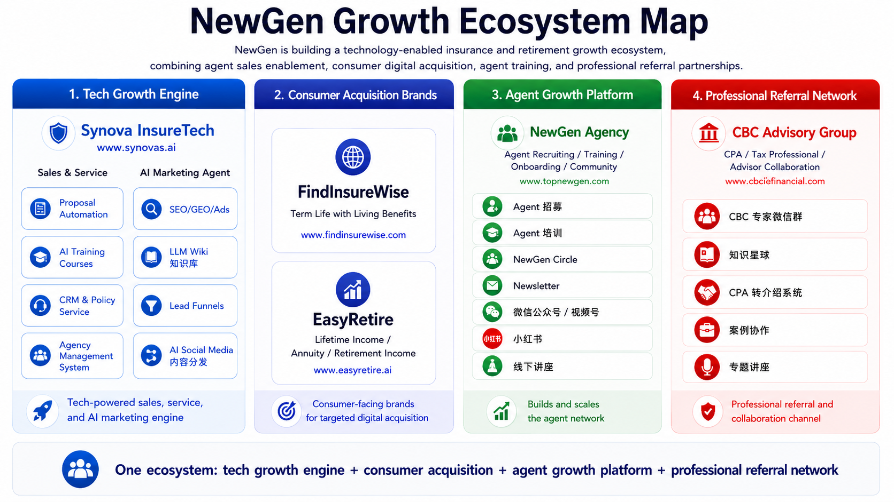
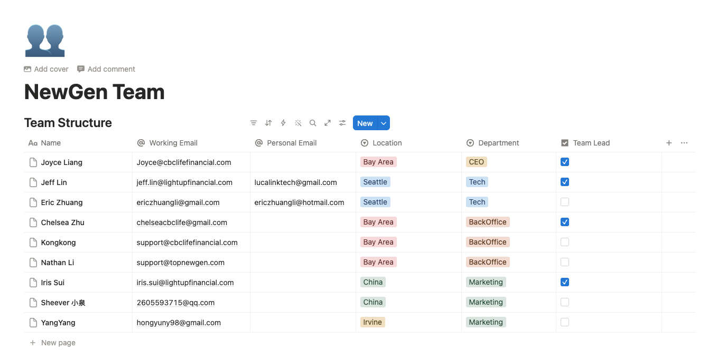

# NewGen 团队分工规划

Interactive team task board for the NewGen Growth Ecosystem. Tracks department key tasks and individual member todos with priority labels, drag-and-drop reassignment, and versioned HTML snapshots.

**Live:** https://lucalinkai.github.io/newgen-taskboard/

## Ecosystem



## Team



## Using the board

| Action | How |
|--------|-----|
| Enter edit mode | Press `E` or click **✏ 编辑** |
| Exit edit mode + save | Press `E` again or click **💾 完成** |
| Save to browser | `Cmd/Ctrl + S` |
| Cycle task priority | Click the priority badge |
| Reorder / reassign task | Drag the `⠿` handle |
| Export versioned snapshot | Click **↓ 导出** |
| Reset to defaults | Click **↺ 重置数据** |

> **☁ 发布** and **🕐 历史** are only visible when running locally — they are hidden on the live GitHub Pages site.

## Publish workflow

```
Your browser (local)
  │
  ├─ 1. Bumps version: data.version 1.0.0 → 1.0.1
  ├─ 2. Saves to localStorage
  ├─ 3. Bakes current data into DEF → builds full HTML string
  │
  ├─ 4. GitHub API: GET index.html → gets current SHA
  ├─ 5. GitHub API: PUT index.html (new content) → updates live page
  └─ 6. GitHub API: PUT versions/v1.0.1_20260605-150000.html → archives snapshot
           │
           └─ push triggers GitHub Actions → Pages redeploys in ~60s
```

## Version history (🕐 历史)

```
Click 🕐 历史
  │
  └─ GitHub API: GET versions/ folder
       → lists all archived files
       → sorted newest first
       → current version marked 当前版本 (rollback disabled)
```

## Rollback

```
Click 回滚 on v1.0.0
  │
  ├─ 1. GitHub API: GET versions/v1.0.0_TIMESTAMP.html
  │       → fetches that file's content (already base64)
  │
  ├─ 2. GitHub API: GET index.html → gets current SHA
  │
  └─ 3. GitHub API: PUT index.html (old content, same SHA)
           → commit message: "rollback to v1.0.0"
           └─ triggers GitHub Actions → Pages redeploys with old version
```

> Rollback does **not** create a new entry in `versions/` — it just overwrites `index.html`. If you publish again after a rollback, the version counter picks up from where it left off.

## GitHub token setup (one-time)

1. Create a fine-grained PAT at https://github.com/settings/personal-access-tokens/new
   - Repository access: `LucaLinkAI/newgen-taskboard`
   - Permissions: **Contents — Read and write**
2. Paste it into `config.local.js`:
   ```js
   localStorage.setItem('ng-gh-token', 'github_pat_...');
   ```
3. Reload `NewGen_Team_Interactive.html` — token is silently loaded, no further prompts.

`config.local.js` is gitignored and never committed or visible on GitHub Pages.

## Files

| File | Purpose |
|------|---------|
| `NewGen_Team_Interactive.html` | Working copy — edit this locally |
| `config.local.js` | Gitignored local config — stores GitHub PAT |
| `publish.sh` | CLI publish script (alternative to the button) |
| `.github/workflows/deploy.yml` | Auto-deploy to Pages on every push to `main` |
| `versions/` | Archived HTML snapshots (managed automatically by publish button) |
